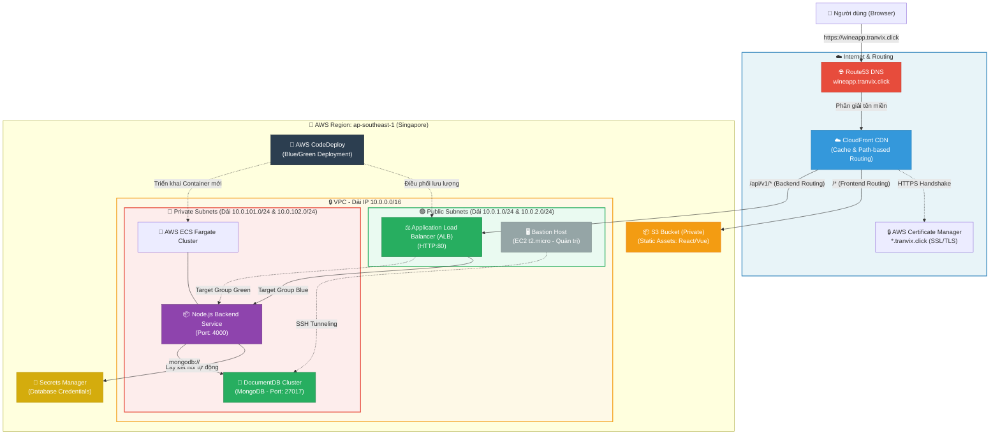
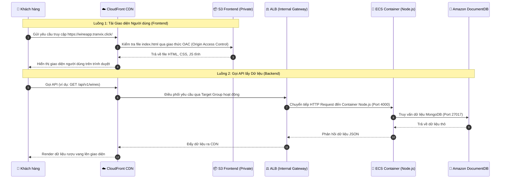

# 🍷 Wine App - Production-Ready AWS Cloud Architecture & Infrastructure as Code (IaC)

Dự án này chứa toàn bộ mã nguồn cơ sở hạ tầng (Infrastructure as Code - IaC) được viết bằng **Terraform** để thiết lập, vận hành và quản lý ứng dụng **Wine App** trên nền tảng đám mây AWS. Kiến trúc này được thiết kế dựa trên các tiêu chuẩn bảo mật, độ tin cậy và khả năng mở rộng cao nhất của AWS (AWS Well-Architected Framework), sẵn sàng cho môi trường Production thực tế.

---

## 📐 1. Kiến trúc Hệ thống (System Architecture)

Hệ thống được thiết kế theo mô hình **Single Domain Architecture** thông qua **Amazon CloudFront** đóng vai trò là điểm tiếp nhận duy nhất (Single Entry Point) cho cả Frontend và Backend. Điều này không chỉ tăng hiệu năng truy cập toàn cầu nhờ cơ chế caching mà còn giải quyết triệt để vấn đề CORS (Cross-Origin Resource Sharing).

### 1.1. Sơ đồ Cấu trúc Tổng quan



### 1.2. Luồng Xử lý Dữ liệu (Sequence Diagram)



---

## 📂 2. Cấu trúc Thư mục Dự án (Project Folder Structure)

```text
wineapp-tf-modules/
├── tf-modules/                         # Chứa các Module Terraform dùng chung (Re-usable Modules)
│   ├── networking/                     # Cấu hình VPC, Subnets, Route Tables, NAT Gateway
│   ├── security/                       # Khởi tạo Security Groups cho tất cả các tài nguyên
│   ├── bastion/                        # Bastion Host (EC2) dùng làm cổng nhảy quản trị Database
│   ├── iam/                            # Quản lý IAM Roles (ECS Exec, Task Role, CodeDeploy Role)
│   ├── route53/                        # Cấu hình DNS Record & AWS ACM Certificate (SSL) ở us-east-1
│   ├── load_balancer/                  # Application Load Balancer & Target Groups (Blue/Green)
│   ├── s3_frontend/                    # S3 Bucket lưu trữ React Web Static & Block Public Access
│   ├── cloudfront/                     # CDN Distribution với OAC và định tuyến đường dẫn (/api/*)
│   ├── ecs_cluster/                    # ECS Cluster, Task Definitions, và ECS Service (Fargate)
│   ├── database/                       # Cluster Amazon DocumentDB và AWS Secrets Manager
│   └── code_deploy/                    # Cấu hình AWS CodeDeploy cho luồng Deployment Blue/Green
│
├── environments/                       # Quản lý môi trường triển khai thực tế (Dev, Staging, Prod)
│   └── dev/                            # Môi trường Development
│       ├── main.tf                     # File chính liên kết và gọi các module
│       ├── variable.tf                 # Khai báo các tham số đầu vào cho môi trường Dev
│       ├── terraform.tfvars            # Giá trị thực tế của các tham số (IPs, Domains, Images)
│       ├── provider.tf                 # Khai báo AWS Provider và Backend cấu hình
│       └── output.tf                   # Định nghĩa các giá trị đầu ra (DNS, ARNs) sau khi Apply
│
├── wineapp-backend/                    # Mã nguồn Node.js Backend API
│   ├── Dockerfile                      # File cấu hình build Image Docker (Platform AMD64)
│   ├── .dockerignore                   # Danh sách file loại trừ khi build (Tránh conflict node_modules)
│   └── appspec.json                    # Cấu hình vòng đời ứng dụng cho AWS CodeDeploy
│
├── wineapp-frontend/                   # Mã nguồn React Frontend
│   └── src/
│       └── config/
│           └── utils.js                # Chứa BASE_URL cấu hình relative path ("/api/v1")
│
└── README.md                           # Tài liệu chi tiết dự án (Tệp tin này)
```

---

## ⚙️ 3. Chi tiết các Module Terraform (Terraform Modules)

Dự án được modulize hóa triệt để để tăng khả năng tái sử dụng mã nguồn. Dưới đây là mô tả chi tiết của từng Module:

### 3.1. Module `networking`
* **Nhiệm vụ:** Thiết lập hạ tầng mạng riêng ảo (VPC).
* **Chi tiết tài nguyên:** 
  - 1 VPC (Dải IP mặc định: `10.0.0.0/16`).
  - 2 Public Subnets (dành cho ALB, Bastion Host, NAT Gateway) giúp tiếp nhận lưu lượng từ Internet.
  - 2 Private Subnets (dành cho ECS Containers, DocumentDB) hoàn toàn độc lập với Internet.
  - Internet Gateway (IGW) kết nối Public Subnets ra ngoài.
  - Route Tables & Route Table Associations định tuyến luồng mạng.

### 3.2. Module `security`
* **Nhiệm vụ:** Quản lý tường lửa cấp độ port (Security Groups) cho toàn bộ hệ thống.
* **Quy tắc bảo mật thiết lập:**
  - **Bastion SG:** Chỉ cho phép truy cập SSH (Port 22) từ IP được chỉ định.
  - **Public ALB SG:** Chỉ mở Port 80/443 để nhận lưu lượng từ Internet (qua CloudFront).
  - **Private ECS SG:** Chỉ nhận kết nối từ Public ALB thông qua Port 4000 của Container Node.js.
  - **Database SG:** Chỉ nhận kết nối Port 27017 từ Private ECS SG và Bastion SG (để debug).

### 3.3. Module `bastion`
* **Nhiệm vụ:** Tạo máy chủ EC2 trung gian (Bastion Host/Jump Server) trong Public Subnet.
* **Chi tiết:** Cho phép DevOps/SysAdmin tạo kết nối SSH Tunneling an toàn để kết nối trực tiếp vào Amazon DocumentDB phục vụ mục đích kiểm tra và backup dữ liệu.

### 3.4. Module `iam`
* **Nhiệm vụ:** Quản lý định danh và cấp quyền truy cập tối thiểu (Least Privilege).
* **Các IAM Roles khởi tạo:**
  - `ecs_task_execution_role`: Cho phép ECS Agent kéo image từ ECR, ghi log ra CloudWatch, và lấy mật khẩu DB từ Secrets Manager.
  - `ecs_task_role`: Cấp quyền chạy runtime cho container backend.
  - `codedeploy_service_role`: Quyền hạn cho phép AWS CodeDeploy cập nhật thông tin ECS Service, thao tác với ALB Target Group khi chạy Blue/Green Deployment.

### 3.5. Module `route53`
* **Nhiệm vụ:** Đăng ký quản lý bản ghi DNS và xác thực SSL.
* **Chi tiết:** Khởi tạo bản ghi xác thực ACM (AWS Certificate Manager) để tạo chứng chỉ SSL Wildcard (`*.tranvix.click`) tại vùng `us-east-1` (bắt buộc đối với CloudFront).

### 3.6. Module `load_balancer`
* **Nhiệm vụ:** Phân phối tải (Application Load Balancer) trong Public Subnets.
* **Chi tiết:** 
  - ALB tiếp nhận lưu lượng HTTP (Port 80) được chuyển tiếp từ CloudFront.
  - Cấu hình 2 Target Groups: `tg-blue` (nhận traffic chính) và `tg-green` (dùng cho cập nhật CodeDeploy).

### 3.7. Module `s3_frontend`
* **Nhiệm vụ:** Lưu trữ mã nguồn tĩnh (HTML/JS/CSS) của React Frontend.
* **Chi tiết:** S3 Bucket được cấu hình chặn hoàn toàn truy cập công khai (`Block Public Access`). Mọi truy cập bắt buộc phải đi qua CloudFront sử dụng cơ chế chữ ký số OAC (Origin Access Control).

### 3.8. Module `cloudfront`
* **Nhiệm vụ:** CDN phân phối giao diện web toàn cầu và là Router chính của hệ thống.
* **Cơ chế hoạt động:**
  - Định tuyến mặc định (`Default *`): Trỏ về S3 Bucket để tải trang React Frontend.
  - Định tuyến API (`/api/*`): Trỏ về Application Load Balancer để gửi request cho Node.js Backend.
  - Cấu hình HTTPS an toàn sử dụng ACM Wildcard Certificate.

### 3.9. Module `ecs_cluster`
* **Nhiệm vụ:** Chạy các Container Backend Node.js mà không cần quản lý máy chủ vật lý (AWS Fargate).
* **Chi tiết:** 
  - Khởi tạo Task Definition định nghĩa dung lượng RAM, CPU, ECR Image URL, và cấu hình biến môi trường kết nối Database qua Secrets Manager.
  - Tạo ECS Service chạy trong Private Subnets, cấu hình bỏ qua thay đổi vòng đời Task (`ignore_changes = [task_definition]`) để tránh xung đột cấu hình với AWS CodeDeploy.

### 3.10. Module `database`
* **Nhiệm vụ:** Cơ sở dữ liệu NoSQL bảo mật cao.
* **Chi tiết:** Khởi tạo Cluster Amazon DocumentDB (tương thích MongoDB). Tự động tạo mật khẩu ngẫu nhiên có độ phức tạp cao bằng Terraform và lưu trữ trực tiếp vào AWS Secrets Manager dưới dạng JSON connection string.

### 3.11. Module `code_deploy`
* **Nhiệm vụ:** Quản lý quy trình triển khai Blue/Green Deployment tự động cho ECS Service, đảm bảo 0% gián đoạn dịch vụ (Zero Downtime Rollout).

---

## 🚀 4. Hướng dẫn Triển khai Chi tiết (Step-by-Step Deployment Guide)

Hãy tuân thủ quy trình sau để thiết lập dự án từ đầu:

### Bước 1: Khởi tạo và Apply Hạ tầng với Terraform

1. Di chuyển vào thư mục môi trường Dev:
   ```bash
   cd environments/dev
   ```
2. Khởi tạo Terraform và tải các Provider/Module:
   ```bash
   terraform init
   ```
3. Kiểm tra tính hợp lệ của cấu hình:
   ```bash
   terraform validate
   ```
4. Tạo bản xem trước kế hoạch tài nguyên:
   ```bash
   terraform plan
   ```
5. Tiến hành tạo tài nguyên trên AWS:
   ```bash
   terraform apply -auto-approve
   ```
   *Lưu ý:* Quá trình khởi tạo DocumentDB và CloudFront có thể kéo dài từ 10 - 15 phút.

### Bước 2: Đóng gói và đẩy Backend lên AWS ECR

1. Xác thực Docker Client với kho lưu trữ AWS ECR của bạn (thay thế Account ID `022499043310` và Region tương ứng):
   ```bash
   aws ecr get-login-password --region ap-southeast-1 | docker login --username AWS --password-stdin 022499043310.dkr.ecr.ap-southeast-1.amazonaws.com
   ```
2. Đi vào thư mục chứa code Backend:
   ```bash
   cd ../../wineapp-backend
   ```
3. **Quan trọng:** Build Image chỉ định kiến trúc chip xử lý của AWS Fargate (AMD64) để tránh lỗi crash container:
   ```bash
   docker build --platform linux/amd64 -t wineapp-backend:v1.0.0 .
   ```
4. Tag Image trỏ về Repository ECR:
   ```bash
   docker tag wineapp-backend:v1.0.0 022499043310.dkr.ecr.ap-southeast-1.amazonaws.com/tranvix0910/wineapp-backend:v1.0.0
   ```
5. Đẩy Image lên ECR:
   ```bash
   docker push 022499043310.dkr.ecr.ap-southeast-1.amazonaws.com/tranvix0910/wineapp-backend:v1.0.0
   ```

### Bước 3: Build và tải Frontend lên S3 Bucket

1. Đi vào thư mục mã nguồn React Frontend:
   ```bash
   cd ../wineapp-frontend
   ```
2. Đảm bảo cấu hình đường dẫn tương đối `/api/v1` trong file `src/config/utils.js`:
   ```javascript
   export const BASE_URL = "/api/v1";
   ```
3. Cài đặt các gói phụ thuộc và build dự án:
   ```bash
   npm install
   npm run build
   ```
4. Đồng bộ thư mục `build/` (hoặc `dist/`) lên S3 Bucket của bạn:
   ```bash
   aws s3 sync build/ s3://wineapp-dev-frontend-bucket/ --delete
   ```
5. Clear cache CloudFront để cập nhật giao diện mới lập tức:
   ```bash
   aws cloudfront create-invalidation --distribution-id <CLOUDFRONT_ID> --paths "/*"
   ```

---

## 🔒 5. Cơ chế Bảo mật & Tối ưu hóa nổi bật

Dự án tích hợp sâu các cơ chế bảo mật cấp doanh nghiệp:
* **Mạng cô lập (VPC Network Isolation):** Toàn bộ ECS Container và DocumentDB nằm ở Private Subnets, không có Public IP. Internet không thể tiếp cận trực tiếp. Mọi truy cập bắt buộc phải đi qua CloudFront & ALB.
* **Secrets Manager Integration:** Code ứng dụng không hề chứa thông tin đăng nhập MongoDB. Khi container khởi chạy, ECS Agent sẽ lấy credential bảo mật thông qua IAM Role và Secrets Manager ARN, tự động truyền làm tham số môi trường của Container.
* **CloudFront Origin Access Control (OAC):** Ngăn chặn người dùng truy cập trực tiếp vào S3 Bucket thông qua URL của S3. Mọi truy cập tĩnh đều phải thông qua CloudFront và chịu sự quản lý của CDN.
* **Single Domain Routing:** Cả FE và BE chạy chung một domain `wineapp.tranvix.click`. Loại bỏ hoàn toàn sự phức tạp khi xử lý CORS headers và tăng tốc độ tải trang nhờ HTTP/2 multiplexing.

---

## 🔧 6. Cẩm nang Sửa lỗi Thực chiến (Troubleshooting Guide)

Trong suốt quá trình phát triển và hoàn thiện dự án này, chúng tôi đã gặp phải 7 lỗi hệ thống kinh điển. Dưới đây là mô tả nguyên nhân và giải pháp sửa lỗi chi tiết:

### 🔴 Lỗi 1: Docker Build bị crash liên quan đến `node_modules` (Conflict cachemounts)
* **Hiện tượng:** Khi chạy lệnh build Docker image, Terminal báo lỗi `cannot replace to directory... node_modules` hoặc crash tiến trình cài đặt thư viện.
* **Nguyên nhân:** Trong file `Dockerfile` có lệnh `COPY . .` sao chép toàn bộ thư mục làm việc ở máy local vào Container. Việc này vô tình chép đè thư mục `node_modules` (vốn được cài đặt cho môi trường hệ điều hành local, ví dụ macOS) vào môi trường Container (Linux), gây xung đột thư viện nhị phân và làm phình to dung lượng build.
* **Giải pháp:** Tạo file `.dockerignore` tại thư mục gốc backend và khai báo các thư mục thừa:
  ```text
  node_modules
  npm-debug.log
  .git
  .env
  ```

### 🔴 Lỗi 2: ECS Fargate không khởi chạy được Container (CannotPullContainerError)
* **Hiện tượng:** Trên bảng điều khiển ECS Task, trạng thái container báo `STOPPED` kèm lỗi:
  ```text
  CannotPullContainerError: pull image manifest has been retried 7 time(s): image Manifest does not contain descriptor matching platform 'linux/amd64'
  ```
* **Nguyên nhân:** Máy tính cá nhân của lập trình viên sử dụng chip Apple Silicon (M1/M2/M3) dựa trên kiến trúc **ARM64**, nên lệnh build Docker thông thường sẽ tạo ra Image tương thích chip ARM64. Tuy nhiên, ECS Fargate mặc định chạy trên nền tảng chip **AMD64 (x86_64)** của Intel/AMD, dẫn đến việc không thể đọc được cấu trúc tập lệnh của Image.
* **Giải pháp:** Khi build Docker image ở máy local, bắt buộc phải truyền cờ `--platform` để chỉ định trình biên dịch đóng gói theo cấu trúc AMD64:
  ```bash
  docker build --platform linux/amd64 -t wineapp-backend:v1.0.0 .
  ```

### 🔴 Lỗi 3: ECS Container liên tục Restart và báo lỗi ResourceInitializationError
* **Hiện tượng:** ECS Task liên tục đổi trạng thái giữa `PENDING` và `STOPPED`. Xem log sự kiện hiển thị:
  ```text
  ResourceInitializationError: unable to pull secrets or registry auth: execution role for task has failed to retrieve verification credentials from secrets manager
  ```
* **Nguyên nhân:** Do hai nguyên nhân chính:
  1. *Ban đầu:* Tham số `mongodb_connection_string_secret_arn` truyền vào Task Definition trỏ tới một ARN giả lập (dummy string) chưa được tạo thật trên AWS.
  2. *Về sau:* IAM Policy gán cho ECS Task Execution Role quy định quyền truy cập vào két sắt Secrets Manager có định dạng tên `wine-app-*`, nhưng thực tế tên Secret được tạo ra trong module database lại là `wineapp-*` (thiếu dấu gạch ngang). Do đó, ECS Role bị từ chối truy cập (Access Denied).
* **Giải pháp:** 
  1. Thay thế ARN giả bằng cách sử dụng tham chiếu trực tiếp output từ module database: `mongodb_connection_string_secret_arn = module.aws_database.mongodb_connection_string_arn`.
  2. Cập nhật lại tệp tin JSON cấu hình IAM Policy trong module IAM để tên resource khớp hoàn toàn với quy chuẩn đặt tên thực tế: `arn:aws:secretsmanager:*:*:secret:wineapp-*`.

### 🔴 Lỗi 4: CodeDeploy bị từ chối quyền PassRole (iam:PassRole AccessDenied)
* **Hiện tượng:** Quá trình chạy CodeDeploy Deployment Group báo lỗi Access Denied:
  ```text
  User: arn:aws:sts::022499043310:assumed-role/wineapp-codedeploy-service-role/d1LDN29BAJ is not authorized to perform: iam:PassRole on resource: arn:aws:iam::022499043310:role/wineapp-task-execution-role because no identity-based policy allows the iam:PassRole action
  ```
* **Nguyên nhân:** Dịch vụ AWS CodeDeploy cần quyền chuyển giao vai trò (`iam:PassRole`) cho ECS Task Execution Role để vận hành các container mới. Nhưng trong file JSON định nghĩa policy của CodeDeploy (`codedeploy_service_policy.json`), phần cấu hình Resource bị giới hạn sai tên (ví dụ: `arn:aws:iam::*:role/*wine-app*` thay vì `wineapp`).
* **Giải pháp:** Chỉnh sửa file IAM Policy để bao quát đúng tên Role của dự án:
  ```json
  {
    "Effect": "Allow",
    "Action": "iam:PassRole",
    "Resource": [
      "arn:aws:iam::022499043310:role/*wineapp*"
    ]
  }
  ```
  Sau đó thực hiện `terraform apply` để cập nhật quyền.

### 🔴 Lỗi 5: Thay đổi Terraform cấu hình ECS Service không có tác dụng
* **Hiện tượng:** Lập trình viên thay đổi cấu hình ECS Service (ví dụ như tăng RAM/CPU hoặc đổi biến môi trường) và chạy `terraform apply` báo thành công, nhưng hệ thống thực tế vẫn chạy phiên bản cũ.
* **Nguyên nhân:** Do hệ thống cấu hình sử dụng Blue/Green Deployment qua CodeDeploy, chúng ta bắt buộc phải khai báo khối lệnh sau trong định nghĩa ECS Service của Terraform:
  ```hcl
  lifecycle {
    ignore_changes = [task_definition, load_balancer]
  }
  ```
  Điều này ngăn Terraform can thiệp ghi đè lên các bản ghi Task Definition đang được CodeDeploy quản lý và chuyển đổi. Tuy nhiên ở môi trường Dev, điều này vô tình chặn các cập nhật cấu hình trực tiếp từ Terraform.
* **Giải pháp:** Ép Terraform hủy bỏ hoàn toàn ECS Service cũ và tái khởi tạo lại từ đầu để ăn cấu hình mới bằng cờ `-replace`:
  ```bash
  terraform apply -replace="module.aws_ecs_cluster.aws_ecs_service.backend_service"
  ```

### 🔴 Lỗi 6: Không thể tạo cơ sở dữ liệu Amazon DocumentDB do lỗi MasterUsername
* **Hiện tượng:** Lệnh `terraform apply` trả về lỗi từ API AWS:
  ```text
  InvalidParameterValue: MasterUsername admin cannot be used as it is a reserved word
  ```
* **Nguyên nhân:** AWS DocumentDB quy định rất nghiêm ngặt về bảo mật và cấm sử dụng các từ khóa hệ thống phổ biến như `admin`, `mongodb`, `root` làm tài khoản quản trị tối cao của cơ sở dữ liệu.
* **Giải pháp:** Đổi giá trị của biến `db_username` trong file cấu hình `terraform.tfvars` sang một tên tài khoản mang tính định danh riêng (ví dụ: `dbadmin` hoặc `wineapp_db_user`).

### 🔴 Lỗi 7: Frontend không thể gọi API trên Production (Lỗi URL Localhost)
* **Hiện tượng:** Khi người dùng truy cập website qua điện thoại hoặc mạng ngoài, giao diện tĩnh hiển thị bình thường nhưng không tải được danh sách rượu vang. Bật F12 Console thấy lỗi gọi kết nối thất bại đến `http://localhost:4000/api/v1/wines`.
* **Nguyên nhân:** Lập trình viên hardcode URL gọi API của môi trường máy cá nhân (`http://localhost:4000`) vào trong mã nguồn Frontend React. Khi đóng gói chạy trên trình duyệt của khách hàng, trình duyệt sẽ cố gắng kết nối tới cổng 4000 trên máy của chính khách hàng đó, dẫn đến mất kết nối hoàn toàn.
* **Giải pháp:** Thay đổi cấu hình URL trong Frontend thành dạng đường dẫn tương đối (Relative Path) để tận dụng luồng điều phối của CloudFront:
  ```javascript
  // file: wineapp-frontend/src/config/utils.js
  export const BASE_URL = "/api/v1";
  ```
  Khi gọi API, trình duyệt sẽ tự động nối tên miền hiện tại (`https://wineapp.tranvix.click`) vào trước đường dẫn `/api/v1/wines`. Yêu cầu này đi tới CloudFront và được CloudFront chuyển tiếp an toàn vào Application Load Balancer ở Singapore.
